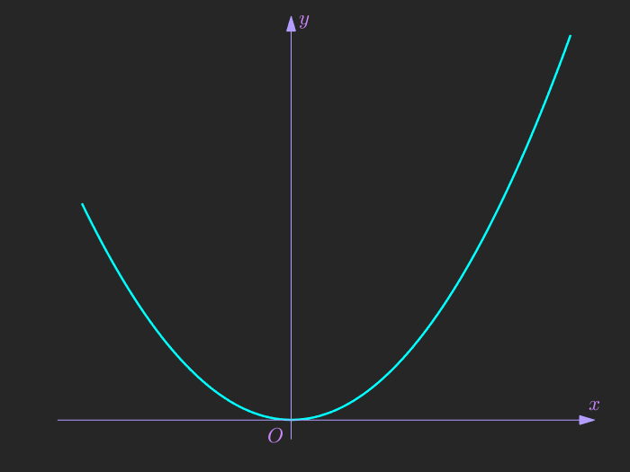
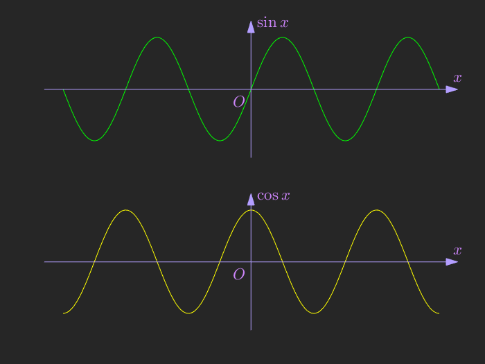
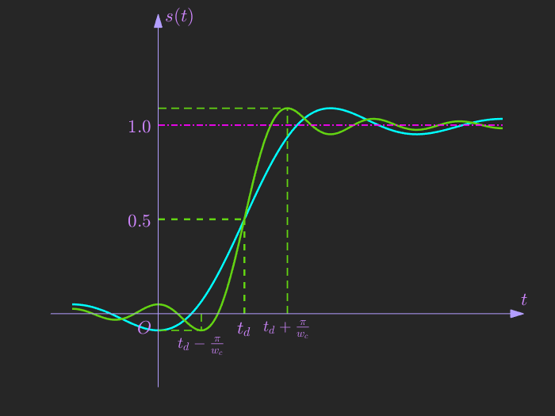

# MatlabDrawNiceGraph
>  Hi! I am 002! Let's draw more beautiful graphics by using Matlab.

你好，我是002！创建此仓库的主要目的是使用Matlab绘制各种好看的图形。你可以根据自己的需求和喜好，复制、修改此仓库的代码。目前实现的功能有：

- [MatlabDrawNiceGraph](#matlabdrawnicegraph)
  - [创建带箭头的坐标系](#创建带箭头的坐标系)

## 创建带箭头的坐标系

**实现如下效果：**

|  |  |  |
| -------------------------------------------------- | -------------------------------------------------- | -------------------------------------------------- |

<!-- 

 -->

以上结果分别是运行 `demo01.m`，`demo02.m`，`demo03.m` 得到的结果，其中使用到的API功能描述如下，函数实现和用法详见源码和实例。

- `DrawAxisWithArrow`  **自动确定**坐标原点在图窗的位置，并以此来绘制带箭头的坐标轴；
  
- `CoorFromAxis2Fig` 进行坐标转换，将点在坐标轴(axis)上的坐标转换为在图窗(figure)的归一化坐标；

- `FigPointLabel` 在图窗上的某点附近添加文字。结合函数 `CoorFromAxis2Fig`，可以很方便在 axis 上添加文字（只需知道该点在 axis 的坐标），如 `demo03` 中坐标轴上的标注均是使用此函数添加的；

- `SaveFig2Img` 保存图窗；

**代码实例(demo01.m)**

```matlab
figure('color', [0.15, 0.15, 0.15]);
x = linspace(-3, 4, 100);
y = x.^2;
plot(x, y, 'Color', [0,1,1], 'LineWidth', 1.5);
% 调用 DrawAxisWithArrow 即可在当前坐标轴绘制带箭头坐标轴
param = struct('XLabel', '$x$', 'YLabel', '$y$', 'OLabel', '$O$');
DrawAxisWithArrow(gca, param);
```

`demo02.py` 是测试在多坐标轴下的运行结果；`demo03.m` 相对前面两个demo实现起来代码稍微冗长繁琐一些（这是一个理想低通滤波器的单位阶跃响应）。
